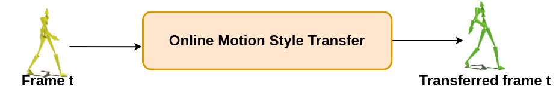

# LSTM-style

This repository contains code for the paper ***Online Motion Style Transfer***. <br /> 


### Abstract:
Motion style transfer is a common method for enriching character animation. Motion style transfer algorithms are often designed for offline settings where motions are processed in segments. However, for online animation applications, such as real-time avatar animation from motion capture, motions need to be processed as a stream with minimal latency. In this work, we realize a flexible, high-quality motion style transfer method for this setting. We propose a novel style transfer model, Style-ERD, to stylize motions in an online manner with an Encoder-Recurrent-Decoder structure, along with a novel discriminator that combines feature attention and temporal attention. Our method stylizes motions into multiple target styles with a unified model. Although our method targets online settings, it outperforms previous offline methods in motion realism and style expressiveness and provides significant gains in runtime efficiency.

---
## Usage of the code

### Install the dependencies
To install the python dependencies, you can create a new virtual environment than install the necessary packages:

```python
python3 -m venv python_env
source python_env/bin/activate
pip install --upgrade pip
pip install -r requirements.txt
```

This setup is tested on *Ubuntu 18.04* with *Python 3.6.9*

---
### Data preprocessing
Currently, a few motion capture clips are stored in `data/xia_test` for basic testing. If you are looking for more data,
you can download it from [Google Drive](https://drive.google.com/file/d/1t5kGoCSjT_kaMBrtcggxVXFmH0bxAMuY/view?usp=sharing).
Then unzip the downloaded `.zip` to `data`

We will release the complete data preprocessing script later.


---
### Test

There is a pretrained model saved under `experiments/pretrained_model`

To reproduce the results shown in the paper, you can run the following command:
```python
python3 test.py --load_dir experiments/pretrained_model --target_style proud --input_motion data/xia_test/neutral_01_000.bvh --input_content walk --input_style neutral --no_pos
```

---
### Training

You need to download the complete dataset from the link shown above to train the models.

To train the *Style-ERD* model, you can run the following command:
```python
python3 train.py --perceptual_loss --no_pos --dis_lr 5e-5 --w_reg 128 --n_epoch 2000 --tag train_Style_ERD
```

To train the content-classification network used by the content supervision module, you can run:
```python
python3 train.py --train_classifier --n_epoch 1000
```
Then you need to move the best model to `data` and name the saved model as `classifier.pt`
