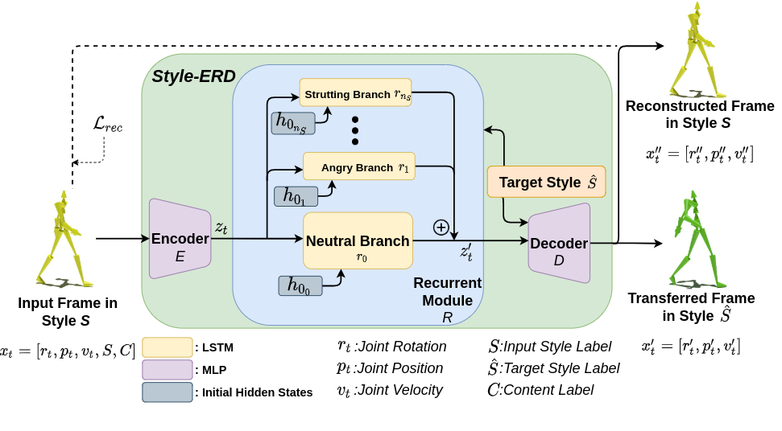

## Abstract

Motion style transfer is a common method for enriching character animation. Motion style transfer algorithms are often designed for offline settings where motions are processed in segments. However, for online animation applications, such as real-time avatar animation from motion capture, motions need to be processed as a stream with minimal latency. In this work, we realize a flexible, high-quality motion style transfer method for this setting. We propose a novel style transfer model, *Style-ERD*, to stylize motions in an online manner with an Encoder-Recurrent-Decoder structure, along with a novel discriminator that combines feature attention and temporal attention. Our method stylizes motions into multiple target styles with a unified model. Although our method targets online settings, it outperforms previous offline methods in motion realism and style expressiveness and provides significant gains in runtime efficiency.

## Supplementary Video

<iframe width="480" height="360" src="figs/Online_Motion_Style_Transfer_Supplementary_Video 720p.mp4" frameborder="0"> </iframe>

